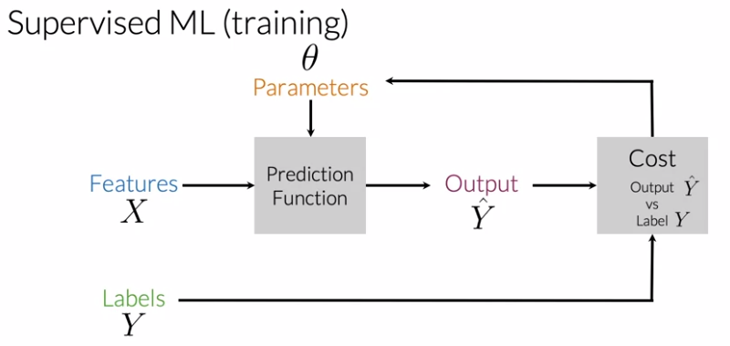
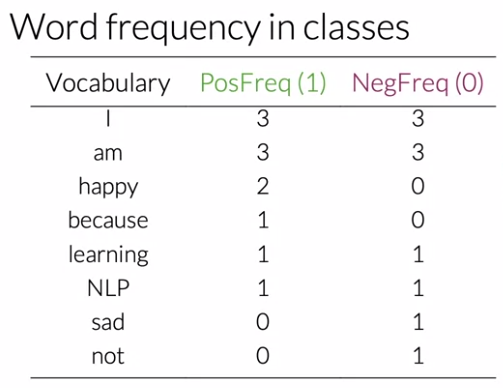
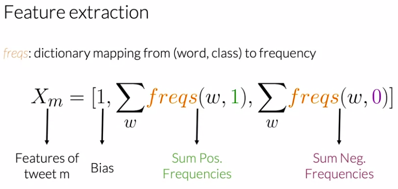
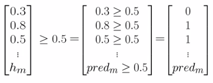
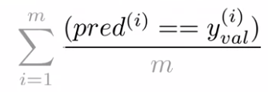

## Supervised ML & Sentiment Analysis

## Vocabulary & Feature Extraction

* **Vocabulary** : All the unique words on your corpus
* **One-hot encoding**: Taking a given input text and a given know vocabulary and marking with 1 where the words on your input text show up on a given position in your vocabulary. The output has dimension $\|V\|$ given by the size of the vocabulary. Usually the output is sparse as the vocabulary is usually large. This technique also don't address the order os the words.

## Negative and Positive Frequencies

Given a set of inputs/tweets classified as positive or negative we can count the words in a given tweet as their frequency in the known classes.

## Feature Extraction with Frequencies

Now, given that the only classes are positive and negative it's possible to output a given vector with the frequency of the classes. The words should only be accounted once even if they repeat.

## Preprocessing

* **Stop Words**: words that do not aggregate meaning to the given sentence. Usually connectives and prepositions.
* **Puntuaction**: symbols that do not aggregate meaning to the given sentence. Usually are part of URLs or other forms of expression that not words (emphasis, emojis)
* **Stemming**: Leaving only the radical of the word in the output. Multiple conjugations and people flexions have the same radical therefore easening the learning.
* **Lowercasing**: Normalization of the given input to a single type of character.

## Natural Language preprocessing

Ungraded Lab 1

## Putting it All Together
Pipeline to extract the features for a set of tweets.

## Visualizing word frequencies

Ungraded Lab 2

## Logistic Regression: Testing

Given a trained 

## Logistic Regression: Cost Function

The first term focus on how much it agrees with the positive data classification. The second term balance with the negative data classification. Here they have the same relationship but given a different penalty one could be maximized better than the other if desired.

## Assignment: Logistic Regression

Graded Notebook 