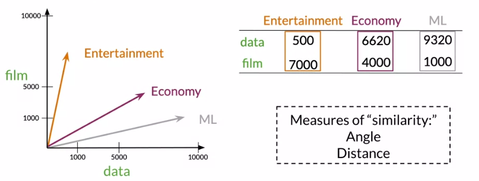

<script type="text/x-mathjax-config">
MathJax.Hub.Config({
  tex2jax: {inlineMath: [['$','$'], ['\\(','\\)']]},
  displayAlign: "left"
});
</script>
<script src='https://cdnjs.cloudflare.com/ajax/libs/mathjax/2.7.5/latest.js?config=TeX-MML-AM_CHTML' async></script>

## Vector Space Models

Can be used to identify similarity, question answering, paraphrasing and summarization.

You shall know a word by the company it keeps.

## Co-occurence Matrix

Word by Word - Number of times they occur together within a certain distance k.

Word by Document - Number of times a word occur within a certain category.



## Euclidean Distance

The distance between them is the straight line that connects them which is given by $d(B, A) = \sqrt{(B_1 - A_1)^2 + (B_2 - A_2)^2}$ in a more general way can be expressed as $d(\overrightarrow{v}, \overrightarrow{w}) = \sqrt{\sum_{i=1}^{n}{(v_i - w_i)^2}}$ for a n dimensional vector space.

In python it can be given as
```python
d = np.linalg.norm(v-w)
```

## Cosine Similarity: Intuition

The cosine distance measures the inner distance between two vectors.

## Cosine Similarity

Vector norm:

* $$||\overrightarrow{v}|| = \sqrt{\sum_{i=1}^{n}v_i^2}$$

Dot Product:

* $$\overrightarrow{v} . \overrightarrow{w} = \sum_{i=1}^{n}v_i.w_i$$

Cossine Similarity:


TODO:
* Criar projeto no padrão especificado no Teams
* Extrair os frames com ffmpeg
* Escrever script para isso
* Perguntar sobre metas
* Perguntar sobre OKRs
* Perguntar sobre remuneração variada basead nas metas
* Adicionar metas no pulses
* Falar com os DS da reunião de acesso simultâneo
* Treinar modelo com alexnet
* Fazer inscrição na smart
* Voltar a malhar todo dia
* Mandar mensagem para Tiago quando completar 30 dias pós B2W
* Falar com Andressa para sugestões
* Ver se os DS do acesso estão no grupo de dados do COE, se n tiverem ver se tem um grupo próprio
* Testar código do Keras para processamento na nuvem
* Escrver sobre o número de Dunbar
* 